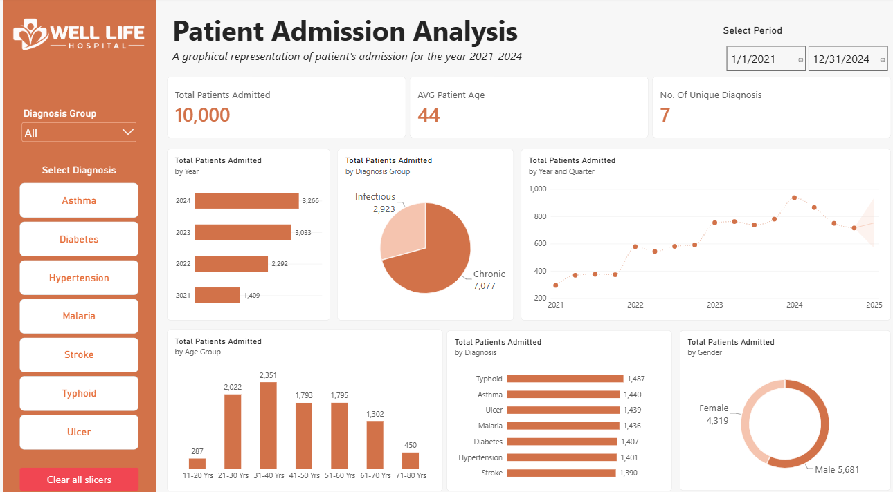

# Patient Admission Analysis: Well-Life Hospital

A Power BI project analyzing hospital admissions from 2021 to 2024 to identify patient trends and support resource planning for 2025.

## Key Findings

- 10,000 admissions analyzed across four years.
- Annual admissions increased from 1,409 in 2021 to 3,266 in 2024.
- Average patient age: 44 years, with adults aged 21–60 accounting for approximately 80% of admissions.
- Chronic diseases accounted for 70.77% of admissions, while infectious diseases accounted for 29.23%.
- Typhoid recorded the highest diagnosis count (1,487), while stroke had the lowest (1,390).
- Q1 2025 forecast: 752 admissions (95% confidence interval: 567–937).

## Recommendations

- Plan for 3,300–3,500 annual admissions, with a 10–15% capacity buffer.
- Strengthen chronic disease management and outpatient follow-up.
- Maintain adequate malaria and typhoid medication supplies.
- Align staffing and resources with patient demand.

## Tools

Power Query · Power BI

## Repository Contents

- `business-brief.md`: Business problem and objectives.
- `dataset/`: Admission data.
- `report/`: Analysis report and slides.
- `dashboard/`: Power BI file (.pbix).
- `images/`: Dashboard and pivot table previews.

Author: Aruya Promise
